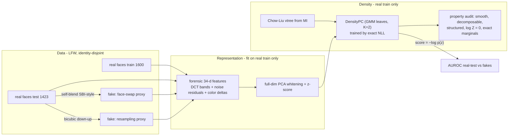

# POC — Deepfake Detection with Probabilistic Circuits

**One-line summary:** the PCNET recipe (arXiv:2605.05953 — a probabilistic circuit as a
tractable density estimator over LLM residual streams, NLL as hallucination score)
transfers to deepfake detection: train the PC on embeddings of **real faces only**,
score any face by its **exact negative log-likelihood**. Fakes are geometric
anomalies — they land in low-density regions of the real-face distribution.

**Result:** AUROC **0.81** on self-blended face swaps and **0.96** on resampling
artifacts, matching Mahalanobis and approaching a full-covariance GMM, with every
circuit property (smoothness, decomposability, structured decomposability, Z = 1,
exact marginals) validated at run time.

---

## 1. Why this should work (and where it can fail)

PCNET's core claim is domain-agnostic:

> Anomalies of a generative process live in low-density regions of a well-chosen
> representation space. A tractable density estimator over that space detects them
> with an exact, cheap, single-pass score.

| | Hallucination (PCNET) | Deepfake (this POC) |
|---|---|---|
| Generative process | LLM decoding | camera → (maybe) manipulation |
| Representation | residual stream `h_t` | image embedding `f(x)` |
| "Normal" data | factual generations | real faces |
| Anomaly | hallucinated token states | manipulated faces |
| Score | exact `−log p(h_t)` | exact `−log p(f(x))` |

The one thing that does **not** transfer automatically is the representation.
The residual stream already encodes "factuality geometry"; a vision embedding must
be *chosen* so that manipulation artifacts survive in it. That choice — not the
circuit — decided every result in this POC (see §6, Lesson 1).

---

## 2. Probabilistic-circuit background in 5 minutes

A PC is a computation graph over three node types, evaluated bottom-up in log-space:

- **Leaf** — a normalized univariate density over one feature (Gaussian, mixture of
  Gaussians, categorical, …).
- **Product** (`×`) — multiplies children defined over **disjoint** feature sets
  (log-space: sum).
- **Sum** (`+`) — weighted mixture of children over the **same** feature set,
  weights softmax-normalized (log-space: logsumexp).

### The properties this project must never break

| Property | Statement | What it buys |
|---|---|---|
| **Smoothness** | every sum's children share one scope | marginalizing a variable stays exact |
| **Decomposability** | every product's children have disjoint scopes | marginals factorize; single-pass exact `log p(x)` |
| **Structured decomposability** | all products split scopes the way one shared **vtree** prescribes | products of two circuits, advanced queries (SOS mode) |
| **Normalization Z = 1** | leaves normalized + softmax sum weights (consequence, not extra work) | NLL is a calibrated density, not just a score |

Smoothness + decomposability ⇒ `log p(x)`, any marginal `p(x_S)`, and the partition
function are all **exact and linear-time in circuit size**. This is the entire
advantage over VAEs/flows/energy models used by prior one-class deepfake work: their
scores are approximate (ELBO) or expensive; ours is exact and comes with exact
marginals for free — which enables *localization* ("which features are anomalous"),
the strongest future differentiator (§7).

### A worked micro-example (2 features)

Density over `x = (x₁, x₂)` — a mixture of two "styles" of correlated behavior:

```
                 (+)  w = [0.6, 0.4]           vtree:    ( {1,2} )
                /    \                                    /      \
             (×)      (×)                              {1}       {2}
            /   \    /   \
     N(x₁;0,1) N(x₂;0,1)  N(x₁;3,1) N(x₂;3,1)
```

`p(x) = 0.6·N(x₁;0,1)·N(x₂;0,1) + 0.4·N(x₁;3,1)·N(x₂;3,1)`

- **Exact evaluation** at `x=(0,0)` (N(0;0,1)=0.399, N(3;0,1)=0.0044):
  `p = 0.6·0.399·0.399 + 0.4·0.0044·0.0044 ≈ 0.0955` → `−log p ≈ 2.35`.
  At `x=(0,3)` (a point *neither* component likes — "mismatched style", the anomaly):
  `p = 0.6·0.399·0.0044 + 0.4·0.0044·0.399 ≈ 0.0018` → `−log p ≈ 6.34`. Higher NLL ⇒ anomaly,
  even though **each coordinate on its own is perfectly normal**. That is what a
  product-of-marginals model can never see, and why circuit structure matters.
- **Exact marginal** `p(x₁)`: replace every `x₂` leaf by its integral (= 1):
  `p(x₁) = 0.6·N(x₁;0,1) + 0.4·N(x₁;3,1)`. One pass, no integration.
- Both children of the sum have scope `{1,2}` (smooth ✓); every product splits
  `{1,2}` into `{1}|{2}` as the vtree says (decomposable + structured ✓).

With the library this is:

```python
from allinone_probabilistic_circuits import (
    DensityPC, GaussianLeaf, VtreeInternal, VtreeLeaf)

vtree = VtreeInternal(VtreeLeaf(0), VtreeLeaf(1))
pc = DensityPC(vtree, n_sum_components=2, leaf_factory=GaussianLeaf)
pc.validate()                      # smooth + decomposable + structured ✓
pc.log_prob(z)                     # exact log p(z)
pc.log_marginal(z, [1])            # exact log p(z₁), x₂ integrated out
pc.log_partition()                 # exactly 0  (log 1)
```

---

## 3. Pipeline



Everything that *learns* (features scaler, whitening, vtree, circuit) sees **only
real training faces**. Fakes are built **only from test identities**, so no fake
and no test identity leaks into training in any form.

### Pseudo-fakes (no deepfake dataset needed for a POC)

1. **Self-blend** (proxy for face swaps, after Self-Blended Images, CVPR 2022):
   take target face T and a *different identity* source S; color-match S to T
   inside a soft elliptical face mask; push S through a down-up resample (the
   warping/generator fingerprint); alpha-blend under the blurred mask. Reproduces
   the two classic face-swap artifacts — blending boundary + donor/background
   statistical mismatch.

   ```
   target T ─────────────────────────────┐
   source S → color-match → down-up ─→ M·S + (1−M)·T    M = blurred ellipse
   ```

2. **Down-up** (proxy for generator upsampling): whole-image bicubic down-up
   resample at factor 0.45–0.6. Easier; purely spectral.

### Features (the load-bearing choice)

34-d forensic descriptor, all artifact-sensitive, no semantics:

- **16 radial log-DCT band energies** — resampling/generator fingerprints are
  spectral (Frank et al., ICML 2020);
- **9 noise-residual moments** (std/skew/kurtosis per RGB channel of a high-pass
  residual) + **3 cross-channel residual correlations** — blending disturbs sensor
  noise;
- **6 inner-ellipse vs outer-ring color deltas** — self-blending breaks
  face/background color consistency.

Then **full-dimension PCA whitening** (fit on real train): a fixed invertible
linear map that absorbs linear correlations so circuit capacity goes to
non-Gaussian structure. The PC still models a valid normalized density — in
rotated coordinates — so all properties are untouched.

---

## 4. Results

AUROC, real-test vs fakes (higher is better). All density models trained on the
same real-only features.

| setup | self-blend | down-up |
|---|---|---|
| ResNet18 avg-pool + PCA24 — *every model* | ~0.55 | ~0.53 |
| forensic 34-d, raw: PC(chow-liu) | 0.684 | 0.958 |
| forensic 34-d, raw: PC(random vtree) | 0.585 | 0.966 |
| forensic 34-d, raw: Mahalanobis / GMM-full(4) | 0.735 / 0.836 | 0.962 / 0.981 |
| forensic whitened: **PC(chow-liu)** | **0.807** | **0.959** |
| forensic whitened: Mahalanobis / GMM-full(4) | 0.807 / 0.842 | 0.960 / 0.986 |

Property audit passed after **every** training run:
`smooth ✓ decomposable ✓ structured-decomposable ✓ log Z = 0 ✓ exact marginals ✓`.

Train-NLL evidence that structure matters (raw features, after the symmetry fix):
Chow-Liu vtree **13.98** vs random vtree **27.51** — 13.5 nats from structure alone.

---

## 5. How to run

```bash
# env: conda cvad_venv (torch 2.8, torchvision, cv2, sklearn)
PY=~/miniconda3/envs/cvad_venv/bin/python

# main configuration (forensic features + whitening)
POC_FEATURES=forensic POC_WHITEN=1 $PY -u src/poc_deepfake_pc.py

# ablations
POC_FEATURES=forensic $PY -u src/poc_deepfake_pc.py   # no whitening
POC_FEATURES=resnet   $PY -u src/poc_deepfake_pc.py   # semantic features (fails)
```

First run downloads LFW (~230 MB) and caches features; reruns skip both.
Each PC trains in ~2–4 min (CPU, scalar-parameter implementation).

---

## 6. The three lessons (read before extending)

**Lesson 1 — the embedding decides everything.** Globally-pooled ImageNet
ResNet-18 features put *every* model at chance (~0.55): global average pooling and
semantic training wash out the low-level artifacts deepfakes leave. Artifact
signal lives in spectra, noise residuals, and local inconsistencies. Any follow-up
must use artifact-preserving representations: forensic features, CLIP-ViT
**patch** tokens (UnivFD showed the CLIP space keeps generator traces), or
high-pass/DCT input streams.

**Lesson 2 — the silent product-of-marginals collapse.** `fit_leaves(jitter=…)`
in `allinone_probabilistic_circuits.py` only jitters leaves exposing scalar
`mu`/`log_sigma`. `GaussianMixtureLeaf` has `mus`/`log_sigmas` (plural) → **no
jitter** → the K sibling subtrees under every sum start exactly identical →
gradient symmetry keeps them identical forever → the mixture collapses to a
product of marginals. Diagnostic signature: Chow-Liu and random vtrees produce
*byte-identical* NLL curves. The POC works around it with `SymBrokenGMLeaf`
(noise on `mus`/`logits` inside the leaf's own `fit()`); the real fix belongs in
the library. **Always run the random-vtree control: if it matches the learned
vtree exactly, the mixture is dead.**

**Lesson 3 — don't make the tree pay for linear correlations.** A tree PC with
small K spends its capacity modeling covariance that a full-covariance Gaussian
gets for free (raw: PC 0.684 vs Mahalanobis 0.735). Full-dim whitening as a fixed
preprocessing bijection removes that tax (whitened: PC = Mahalanobis = 0.807);
capacity then goes to non-Gaussian structure, which is the only place a PC can
*beat* Mahalanobis. Note the flip side: after whitening the vtree stops mattering
(random ≈ chow-liu) because linear dependence is gone — structure learning only
pays on correlated coordinates.

---

## 6b. Real-deepfake validation (added later on 2026-07-16) — honest negative

`POC_DATA=openforensics` adds real deepfakes: the HF mirror
`Hemg/deepfake-and-real-images` (OpenForensics-derived 256×256 face crops;
fakes are GAN-synthesized faces blended **in-context** into real scenes).
3,000 reals train the PC; 1,500 held-out reals vs 1,500 fakes evaluate.

| features (global) | one-sided NLL | two-sided \|NLL − median\| |
|---|---|---|
| forensic 34-d + whiten: PC / Mahal / GMM | 0.463 / 0.452 / 0.465 | 0.456 / 0.453 / 0.444 |
| ResNet18 + PCA24: PC / Mahal / GMM | 0.422 / 0.409 / 0.424 | — |
| CLIP ViT-L/14 + PCA24w: PC / Mahal / GMM | 0.450 / 0.419 / 0.459 | 0.452 / 0.525 / 0.492 |

**Every global feature space × every density model is at (or slightly below)
chance.** The consistent below-0.5 means fakes sit *closer to the mode* of the
real-face density (smooth GAN faces; the classic likelihood-OOD pathology), and
the two-sided typicality test shows the effect is too weak to exploit. This is
**not** a PC failure — Mahalanobis and GMM-full fail identically — it is a
representation failure with a clear mechanism: in-context swaps share scene,
camera, and compression statistics with the reals *by construction*, so global
statistics are matched; the discriminative signal (supervised CNNs reach >95%
on this data, so it exists) is **local** — the blend boundary and the swapped
interior — and global pooling/PCA destroys it. Two caveats: this Kaggle-derived
mirror recompresses both classes identically (further erasing low-level cues),
and pooled CLIP here differs from UnivFD's *supervised* probing on it.

Consequence for the research plan: the PCNET transfer must go **local** —
per-patch densities over artifact-amplifying representations (CLIP-ViT patch
tokens, SRM/NPR residuals, DIRE-style reconstruction errors), aggregated by
max/consistency scores — and be validated on FaceForensics++ c23 (form-gated,
manual download) rather than recompressed Kaggle mirrors.

## 7. Where the paper is (novelty positioning)

Literature check (July 2026): **no published work combines PCs/SPNs with deepfake
detection.** Closest neighbors:

- one-class deepfake detectors trained on real faces only — SeeABLE (ICCV 2023),
  OC-FakeDect (CVPRW 2020), DiffFake (2025): validate the framing, but all use
  approximate scores (contrastive regressors, ELBOs);
- UnivFD (CVPR 2023): frozen CLIP-ViT features generalize across generators —
  validates the frozen-embedding substrate;
- PC scaling (LVD ICLR 2023, PyJuice, Monarch-HCLTs): the tooling for growing
  this beyond 34 dimensions.

The unique, defensible contribution is what only a smooth + decomposable circuit
can do: **exact localization by marginals** — score `p(z_S)` over patch/feature
subsets to answer *which region/statistic is fake* with exact probabilities
(the Khosravi et al. outlier-explanation query, already anticipated in
`src/bak/cvxpc_probabilistic_circuits.py`), mirroring PCNET's "intervene only
where the geometry deviates."

## File map

| file | role |
|---|---|
| `src/poc_deepfake_pc.py` | this POC (data, pseudo-fakes, features, PC training, audit, eval) |
| `src/bak/allinone_probabilistic_circuits.py` | the PC library: DensityPC, SquaredPC, 5 vtree learners, validators, exact inference |
| `src/bak/cvxpc_probabilistic_circuits.py` | older image-oriented variant (per-pixel scoring idea worth resurrecting) |
| `src/bak/llm_probabilistic_circuits.py` | original PCNET residual-stream circuit (paper code) |
| `hands_off.md` | handoff notes: status, gotchas, next steps |
