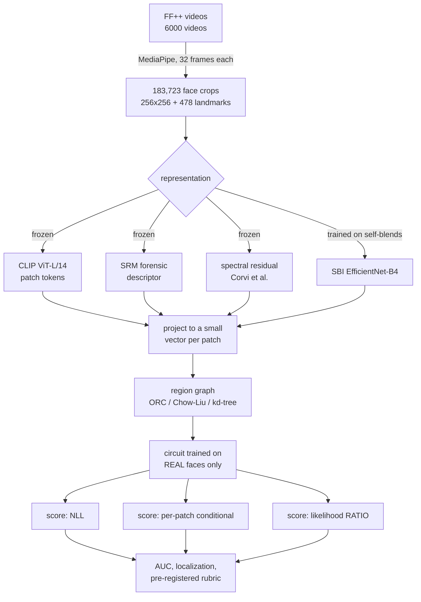

# Deepfake detection with probabilistic circuits — the complete story

*Last updated 2026-08-04. This is the full record: what we tried, what happened,
why, and what it means. Written to be readable without prior context.
`STATUS.md` is the short operational version; `README.md` is the code tour.*

---

## Table of contents

1. [The one-paragraph summary](#1-the-one-paragraph-summary)
2. [The original idea, in plain words](#2-the-original-idea-in-plain-words)
3. [What a probabilistic circuit is](#3-what-a-probabilistic-circuit-is)
4. [What we built](#4-what-we-built)
5. [The data](#5-the-data)
6. [The four representations we tried](#6-the-four-representations-we-tried)
7. [The results, and the moment it went wrong](#7-the-results-and-the-moment-it-went-wrong)
8. [Diagnosis: whose fault is it?](#8-diagnosis-whose-fault-is-it)
9. [The fix: stop asking "is this weird", ask "which process made it"](#9-the-fix)
10. [The fairness check that changed the conclusion](#10-the-fairness-check)
11. [What is definitely true about the implementation](#11-what-is-definitely-true)
12. [Where circuits still have an uncontested claim](#12-uncontested-claim)
13. [How to run everything](#13-how-to-run-everything)
14. [Open problems, ranked](#14-open-problems-ranked)
15. [Appendix: the historical LFW proof of concept](#15-appendix-historical-poc)

---

## 1. The one-paragraph summary

We asked whether a probabilistic circuit trained **only on real faces** can spot
deepfakes by giving them low probability. On real data (FaceForensics++) the
answer is **no — but not for the reason it looks like**. Fake faces are not
weird; they are *more ordinary* than real ones. Once we stopped scoring "how
unusual is this face" and started scoring "which process better explains this
face", every density model jumped from ~0.2–0.6 to ~0.83 AUC. That fix works,
it is important, and it is **not specific to circuits** — a plain Gaussian
mixture does equally well. The circuit's own advantages (exactness, speed,
structure learning) are real and measured, but they do not, so far, buy better
detection.

---

## 2. The original idea, in plain words

Take a big pile of **real** face photos. Learn a probability distribution over
them: a function `p(face)` that says how likely each face is.

```
   many real faces  ──►  learn p(·)  ──►  a "map" of what real faces look like
```

Now show it a new face and compute `p(face)`.

```
   real face   ─►  p = high   ─►  "I've seen things like this"       ✅ real
   fake face   ─►  p = low    ─►  "this is in a weird empty region"  🚩 fake
```

The score is the **negative log-likelihood**, `NLL = −log p(face)`: high NLL
means surprising means suspicious. This is the recipe that worked for detecting
LLM hallucinations (PCNET, arXiv:2605.05953) — hallucinated states sat in
low-density regions of the model's internal space.

The whole project is the question: **does that transfer to faces?**

The hidden assumption, which turns out to be the crux:

> ⚠️ *Fakes live in low-probability regions.*

Hold on to that sentence. Section 8 shows it is false for deepfakes.

---

## 3. What a probabilistic circuit is

A circuit is a calculator for probabilities, built from three kinds of node.

```
   LEAF      one number in, one probability out.
             "how likely is THIS single measurement?"
             e.g. a bell curve over feature #17

   PRODUCT   ×   multiply children that describe DIFFERENT things
                 (assumes they're independent given the branch)

   SUM       +   weighted average of children that describe the SAME things
                 (a mixture: "either this pattern, or that one")
```

### A tiny worked example

Two features `x₁, x₂`. Two "styles" of face — say, bright ones and dark ones:

```
                    ( + )   weights 0.6 / 0.4
                   /     \
                ( × )     ( × )
                /   \     /   \
          N(x₁;0,1) N(x₂;0,1)  N(x₁;3,1) N(x₂;3,1)
             "both dark"          "both bright"
```

`p(x) = 0.6·N(x₁;0,1)·N(x₂;0,1) + 0.4·N(x₁;3,1)·N(x₂;3,1)`

Evaluate it:

| point | meaning | p | NLL |
|---|---|---|---|
| (0, 0) | dark + dark ✔ consistent | 0.0955 | **2.35** |
| (3, 3) | bright + bright ✔ consistent | 0.0637 | 2.75 |
| (0, 3) | dark + bright ✘ **inconsistent** | 0.0018 | **6.34** |

Look at the last row. Each coordinate on its own is perfectly normal — `x₁=0`
is a fine dark value, `x₂=3` is a fine bright value. Only the **combination**
is strange. A model that looked at each feature separately would see nothing.
This is why structure matters, and it is exactly the shape of a face swap:
the swapped region is a normal face, the background is a normal background,
but they don't belong together.

### The four properties we never break

| property | plain meaning | what it buys |
|---|---|---|
| **smooth** | every `+` mixes children about the same variables | you can integrate a variable out exactly |
| **decomposable** | every `×` splits variables into disjoint groups | one pass gives the exact answer |
| **structured decomposable** | all `×` split the same way, following one shared plan (a "vtree") | lets you multiply/square circuits |
| **normalized (Z = 1)** | probabilities sum to exactly 1 | NLL is a real density, not a made-up score |

Smooth + decomposable ⇒ you get, **exactly and in one pass**:

```
   log p(x)            the full probability
   log p(x_S)          any MARGINAL: "ignore everything except region S"
   log p(x_S | x_rest) any CONDITIONAL: "how odd is S given its surroundings"
   log P(a ≤ x ≤ b)    any BOX query
```

Nothing else in the one-class toolbox does this. A normalizing flow gives you
`log p(x)` exactly but **no marginals**. A memory bank (PatchCore) gives
distances but **no probabilities**. A VAE gives only a bound.

---

## 4. What we built



The pieces, and where they live:

| what | file | note |
|---|---|---|
| the circuit engine | `pcdf/circuits/einsum_pc.py` | our fast version |
| the reference | `src/probabilistic_circuits.py` | your library — the *specification* |
| structure learning | `pcdf/circuits/structure.py` | Chow-Liu, Ollivier-Ricci, Forman, spectral |
| face extraction | `pcdf/data/faces.py` | crop-then-purge, derived masks |
| self-blending | `pcdf/data/sbi.py` | manufacture fakes from reals |
| representations | `pcdf/features/backbones.py` | the four arms |
| the detector | `pcdf/models/density_pc.py` | NLL + per-patch scores |
| the ratio detector | `pcdf/models/ratio.py` | two circuits |
| competitors | `pcdf/models/baselines.py` | Mahalanobis, GMM, PatchCore, flow |
| the diagnosis | `pcdf/eval/diagnose.py` | why did it fail |
| the probe | `pcdf/eval/probe.py` | is the signal even there |

### Why we rewrote the engine

Your reference library builds one Python object per unit and walks the graph
recursively. That is fine for 34 features; it does not finish for 6,080.

```
   reference:   ~10⁵ Python objects, recursive walk, one node at a time
   ours:        the same circuit as a stack of batched matrix ops (einsums)

   level 3   [ ][ ][ ][ ]        all regions of a level computed together
   level 2   [    ][    ]
   level 1   [        ]
```

Same model, same numbers, different execution. Measured: **44.5× faster**
(0.0034 s vs 0.152 s per training step), and `tests/test_equivalence.py` copies
parameters between the two implementations and checks that `log p(x)`, exact
marginals, box queries and `log Z` agree to 2e-4 across six structure families.

---

## 5. The data

**FaceForensics++ c23** — the standard benchmark. 1,000 real videos, and five
ways of faking each one:

```
   real/000.mp4  ──┬─► Deepfakes/000_003.mp4       (neural face swap)
                   ├─► FaceShifter/000_003.mp4     (neural face swap)
                   ├─► NeuralTextures/000_003.mp4  (neural, mouth region only)
                   ├─► Face2Face/000_003.mp4       (GRAPHICS: 3D model + render)
                   └─► FaceSwap/000_003.mp4        (GRAPHICS: 3D model + render)
```

That neural/graphics split becomes important in section 9.

**Splits.** The official identity-disjoint 720/140/140 split. Fake videos
inherit the split of their *target* identity, so no person appears in two
splits in any form.

**What we extracted:** 32 evenly spaced frames per video → face detected with
MediaPipe → square crop with 1.3× margin → 256×256.

```
   6,000 videos → 5,874 gave usable crops → 183,723 crops (4.5 GB)
                  (126 videos: no face found in any sampled frame)

   train 132,809   val 25,484   test 25,430
   of which REAL training frames: 22,115   ← the only thing the circuit sees
```

**Localization ground truth.** This distribution ships no mask videos, so we
derive them: a fake video and its real source are frame-aligned, so

```
   mask = |fake_frame − real_frame|  →  blur  →  threshold
```

Sanity: on Deepfakes this marks ~16% of the crop as manipulated — the right
order for a face swap. Every output labels these `derived_frame_diff`, never
"official masks".

---

## 6. The four representations we tried

The circuit needs *numbers* per face. Which numbers is the whole ballgame.

```
   crop 256×256  →  8×8 grid of patches  →  a small vector per patch
                    (64 patches)             (16 or 95 numbers)
                                             ↓
                                    d = 64 × 16 = 1024 features
                                    (or 64 × 95 = 6080)
```

| arm | what it measures | learned? |
|---|---|---|
| **SRM** | high-pass noise moments, radial spectrum, colour stats | no |
| **CLIP** | semantic content, from a frozen ViT-L/14 | no (pre-trained) |
| **spectral** | 2D residual spectrum (peaks kept!), autocorrelation, high-frequency deficit — after Corvi et al. CVPRW 2023 | no |
| **SBI** | features of an EfficientNet-B4 trained on real frames + self-blends | yes, no real fakes |

**Important detail** that cost us a whole arm: the SRM descriptor *radially
averages* the spectrum. Generator fingerprints are **discrete peaks** at
particular frequencies, and radial averaging smears them into nothing. The
`spectral` arm keeps the 2D layout for exactly this reason.

```
   radial average (SRM)        2D grid (spectral)
   ┌───────────────┐           ┌───┬───┬───┬───┐
   │   ((( )))     │  peaks →  │   │ ● │   │   │  peak position preserved
   │  averaged away│  lost     ├───┼───┼───┼───┤
   └───────────────┘           │   │   │   │ ● │
                               └───┴───┴───┴───┘
```

---

## 7. The results, and the moment it went wrong

Detection, video-level AUC (0.5 = coin flip, 1.0 = perfect). Everything fitted
on real faces only; identical protocol, identical baselines.

| arm | circuit (NLL) | Mahalanobis | GMM | PatchCore | flow |
|---|---|---|---|---|---|
| SRM | 0.624 | 0.628 | 0.531 | 0.627 | — |
| **CLIP** | **0.536** | 0.519 | 0.531 | 0.517 | 0.536 |
| spectral | 0.554 | 0.568 | 0.592 | 0.556 | 0.557 |
| SBI | 0.812 | 0.386 | 0.788 | 0.461 | 0.804 |

Three arms near coin-flip. And a very suspicious pattern: **every model gets
almost the same number**. When a circuit, a Gaussian, a memory bank and a flow
all agree to within 0.02, the model is not the variable.

Worse, the winning score in almost every case was `patch_lowmax` — the branch
that flags patches as suspicious for being **unusually ORDINARY**.

That is the assumption from section 2 failing:

```
   what we assumed:              what we measured:

   real ████████                 real ████████
        ░░░░fake                      ██fake██        ← fakes sit INSIDE,
   ────────────────►             ────────────────►      even more central
     p(face) high → low            p(face) high → low
```

---

## 8. Diagnosis: whose fault is it?

Instead of arguing, we measured. Three suspects, three tests
(`pcdf/eval/diagnose.py`, run on the fitted spectral circuit, d = 6,080).

### First: is there any signal at all?

Train a plain **linear classifier** on the *same* numbers the circuit sees
(trained on the validation split, never on test). This is an upper bound on
what anything could extract from these coordinates.

| arm | linear probe | circuit (NLL) | **gap** |
|---|---|---|---|
| CLIP | 0.775 | 0.536 | **0.239** |
| spectral | 0.802 | 0.554 | 0.248 |
| SBI | 0.859 | 0.812 | **0.047** |

So the signal **is there** — a straight line separates the classes at 0.78–0.86.
The density model recovers almost none of it. The features are not the problem.

### Suspect 1 — DILUTION ✅ confirmed

`log p(z)` is a **sum over all 6,080 numbers**. Most of them describe identity,
pose and lighting — things both classes share. Two different real faces differ
hugely in those; a face and its forgery barely differ at all.

```
   log p(z) = Σ over 6080 coordinates
              └── ~6000 nuisance ──┘ + └── ~50 that matter ──┘
                  huge, irrelevant        small, relevant
                       ↑
                  drowns everything
```

Test: use the circuit's **exact marginals** to score only the most
discriminative coordinates. AUC 0.461 → 0.554, a **+0.093 jump** from ignoring
most of the data. Confirmed.

### Suspect 2 — INVERSION ✅ confirmed

Fraction of forgeries with *higher* likelihood than the median real face:
**55.4%**. Generated and rendered skin is smoother, cleaner, more average than
real camera output. A one-sided NLL is monotone in "typicality", so it cannot
possibly flag things for being too typical.

### Suspect 3 — BAD DENSITY ❌ ruled out

Circuit held-out NLL vs a full-covariance Gaussian on the same data: the
Gaussian is **singular** (infinite NLL — 6,080 dimensions, 20k samples), the
circuit fits fine. The density estimate is good.

**Verdict: the model was fine, the question was wrong.**

---

## 9. The fix

### Why NLL was the wrong question

The one-class score is secretly already a likelihood ratio — against the
*worst possible* model of forgeries:

```
   −log p_real(z)  =  log [ uniform(z) / p_real(z) ] + constant
                             ↑
                    "a fake could be literally anything"
```

That is the right thing to assume when you know nothing about fakes. But we
*can* know something: **self-blends** (SBI, section 15b) manufacture realistic
pseudo-forgeries from real faces alone. So replace the uniform guess with a
learned one:

```
        ┌── p_real  ── trained on real training faces ──┐
   z ──►┤                                                ├──► s(z) = log p_blend − log p_real
        └── p_blend ── trained on SELF-BLENDS of those ──┘        "which process explains z?"
                       same real faces (no real fake!)
```

Two changes, both decisive:

1. **Nuisance cancels.** If a coordinate behaves the same under both models,
   its contribution to the *difference* is ≈ 0. Only coordinates where the two
   processes genuinely differ survive. Dilution solved.
2. **Direction stops mattering.** We never ask "is this typical", only "which
   model explains it better". Inversion solved.

This is Neyman–Pearson: for choosing between two hypotheses, the likelihood
ratio is the optimal statistic.

### Does the construction work? Yes — dramatically

Sanity check on the shift it was trained to see (real vs our own self-blends,
held-out):

| statistic | AUC |
|---|---|
| p_real alone | 0.585 |
| p_blend alone | 0.643 |
| **the ratio** | **0.953** |

Two mediocre densities → one strong detector. The machinery is sound.

### On real forgeries: it depends entirely on the representation

| arm | one-class NLL | **ratio** |
|---|---|---|
| spectral | 0.554 | 0.549 ✗ |
| **SBI** | 0.812 | **0.828** ✓ |

Why the spectral arm failed, from its per-method breakdown:

| method | type | ratio AUC |
|---|---|---|
| Deepfakes | neural | 0.675 ✓ |
| FaceShifter | neural | 0.666 ✓ |
| NeuralTextures | neural | 0.592 ✓ |
| Face2Face | **graphics** | 0.450 ✗ inverted |
| FaceSwap | **graphics** | 0.362 ✗ inverted |

```
                        smoother ◄──── REAL ────► rougher
   graphics forgeries:  ●●●●
   our self-blends:                            ●●●●
                        └── opposite directions! ──┘
```

Our self-blends add noise (resampling, JPEG); 3D-rendered faces *remove* it.
`p_blend` learned the wrong kind of deviation, so half the forgeries score
backwards. (We tested whether compression history explained it — re-encoding
blends to match the crops' JPEG pipeline: no change, 0.549.)

On **SBI features** the gap disappears, because that encoder was trained end to
end to make self-blends and real forgeries look alike. Every method above
chance: Deepfakes 0.920, Face2Face 0.870, FaceShifter 0.842, NeuralTextures
0.808, FaceSwap 0.702.

---

## 10. The fairness check

The ratio needs an exact likelihood — but so do flows, and Gaussians have one
too. So: give **every** baseline the same two-density treatment.

```
   FAIRNESS CHECK (SBI features, FF++ test)
   model          one-class      with ratio
   ─────────────────────────────────────────
   flow             0.200    →     0.828
   GMM              0.225    →     0.830   ← best
   Mahalanobis      0.286    →     0.814
   circuit          0.812    →     0.828
```

**The ratio is the whole gain; the circuit is not.** A Gaussian mixture with
the same construction matches — marginally beats — the circuit. The
pre-registered gate "circuit beats the best non-circuit baseline by ≥0.02"
**fails** under a fair comparison.

Also worth knowing: the circuit's *per-patch conditional* ratio (0.822–0.826)
did **not** beat its own joint ratio (0.828), so conditioning on context bought
nothing measurable here either.

The honest headline is therefore:

> **Likelihood-ratio scoring against a self-blend density rescues one-class
> deepfake detection** — turning 0.20–0.29 (worse than chance) into 0.81–0.83 —
> **and it works for any exact-likelihood model.**

That is a real, useful, transferable result. It is not a result about circuits.

---

## 11. What is definitely true

Independent of the detection disappointment, these are measured and would
survive review:

**The implementation is correct.** Parameters copied both ways between our
engine and your reference library; `log p(x)`, exact marginals over random
masks, box queries and `log Z` agree to 2e-4 — across Chow-Liu, ORC,
multi-partition ORC, Forman, spectral and random structures. 14/14 tests pass.

**It is fast and it scales.**

```
   d = 1024,  K = 8    622k parameters, 2047 regions,  1.2 s/epoch  (GPU)
                                                      11.7 s/epoch  (CPU)
   d = 6080,  K = 8    trains fine with leaf checkpointing
   speedup vs reference object-graph circuit:  44.5×
   log Z after training:  −1.1e-06     (normalization survives optimization)
```

**Structure learning works, and curvature beats Chow-Liu clearly.** Same
features, same budget, only the region graph changes (held-out NLL, lower is
better):

```
   random      1255.7  ├──────────────────────────────────┤
   Chow-Liu    1250.5  ├─────────────────────────────────┤   −5 nats
   ORC         1209.7  ├────────────────────────────┤        −46 nats
   Forman      1086.3  ├──────────────────┤                  −169 nats
```

Reproduced on three different representations. **But** detection AUC stayed
~0.52 for all of them — a much better density is not a better detector. That
disconnect is itself a finding.

**The collapse bug is genuinely fixed.** `tests/test_structure_matters.py`:
K=8 beats a product of marginals by **7.2 nats**, learned structure beats
random by **4.7 nats**, on data built to have exploitable structure.

---

## 12. Uncontested claim

One thing the competitors genuinely cannot do, and it has not yet been tested
with the ratio scores:

```
   per-patch GMM / PatchCore:  each patch scored ALONE, no joint model
                               → cannot ask "given the REST of the face..."

   flow over the whole image:  joint, exact log p(x)
                               → but NO marginals, cannot integrate anything out

   circuit:                    joint AND exact marginals at any scope
                               → log p(z_S | z_rest) for arbitrary regions S
```

So the circuit is the only model that can answer *"is this region inconsistent
with its surroundings"* exactly — which is the literal definition of a blending
artifact. Current localization numbers (with plain NLL, not the ratio) are:

| model | patch AUC | pointing accuracy |
|---|---|---|
| PatchCore | **0.670** | **0.438** |
| PC conditional | 0.568 | 0.218 |
| GMM | 0.540 | 0.206 |
| flow | 0.510 | 0.142 |

PatchCore currently wins. The untested combination — **per-patch likelihood
ratio** as a localization map — is the one remaining experiment that could give
circuits an uncontested win, because it inherits the ratio's cancellation
*and* the circuit's exact conditioning.

---

## 13. How to run everything

```bash
ssh jawa17@192.168.1.8
cd ~/Documents/Unitn/PhD/Main-Project/GitHub/DeepFakeDet
PY=~/miniconda3/envs/expllm_env/bin/python
```

```bash
# one-off: videos → crops (~40 min)
$PY -m pcdf.cli manifest --datasets ffpp
$PY -m pcdf.cli ingest --dataset ffpp --masks

# one arm, end to end  (swap the config for a different representation)
CFG="-c configs/ffpp_sbi.yaml"          # or ffpp_clip / ffpp_spectral
$PY -m pcdf.cli $CFG features --dataset ffpp     # crops → numbers
$PY -m pcdf.cli $CFG probe                       # is the signal there at all?
$PY -m pcdf.cli $CFG fit-pc                      # circuit, real faces only
$PY -m pcdf.cli $CFG baselines                   # the competitors
$PY -m pcdf.cli $CFG evaluate --datasets ffpp
$PY -m pcdf.cli $CFG explain --n-images 2000     # localization
$PY -m pcdf.cli $CFG diagnose                    # why did it fail?
$PY -m pcdf.cli $CFG report                      # → results/<tag>/REPORT.md

# the likelihood-ratio detector
$PY -m pcdf.cli $CFG features --dataset ffpp --pseudo   # self-blend everything
$PY -m pcdf.cli $CFG fit-ratio --limit-test 8000

# structure comparison, and the expressiveness check
$PY -m pcdf.cli $CFG ablate-structure --epochs 25
$PY scripts/sos_experiment.py --config configs/ffpp_spectral.yaml --top-k 128
```

Test it all on a laptop in one minute, no data needed:

```bash
python scripts/smoke_pipeline.py    # synthetic data, every stage, asserts it works
python -m pytest tests/ -q          # 14 tests: equivalence, structure, devices
```

⚠️ **A partial `features` run must be deleted, never resumed** — the projector
is written first and reused, so an interrupted run silently poisons everything
downstream.

---

## 14. Open problems, ranked

**1. Per-patch ratio for localization** (~15 min). The only untested place
where circuits have a capability nothing else has. Decides whether the
"exact explanation" framing survives.

**2. Make the pseudo-fakes cover both directions** (~1 h). Our blends are
*rougher* than real; graphics forgeries are *smoother*. Add a render-like
smoothing mode to `pcdf/data/sbi.py`. A circuit is a mixture model, so
`p_blend` can hold both families natively.

**3. Train the SBI encoder properly** (~5 h). Ours: 40 epochs, 16 frames/video,
val 0.865. Published: ~0.99. Everything downstream inherits that shortfall —
it is the single biggest lever on absolute numbers, though it will not change
circuit-vs-GMM.

**4. Cross-dataset** (blocked). Celeb-DF-v2 needs the official form; without it
the generalization gate cannot be measured. DF40 mirrors exist but are
fake-only, which forces a caveated real/fake source mismatch.

**5. Test Corvi's mechanism on its home ground.** Their analysis is about
*fully synthetic* images with no sensor-noise floor. FF++ re-renders a real
face into a real video and re-encodes at c23, so both classes carry camera
noise. GenImage / diffusion subsets stored losslessly would be the fair test.

---

## 15. Appendix: historical LFW proof of concept

*(The original 2026-07-16 experiment, kept for the record — its lessons still
hold and two of them shaped everything above.)*

Setup: LFW faces, identity-disjoint split, pseudo-fakes made by self-blending
and by down-up resampling. 34-dimensional forensic descriptor, `DensityPC`
with Gaussian-mixture leaves.

| setup | self-blend | down-up |
|---|---|---|
| ResNet18 pooled — *every model* | ~0.55 | ~0.53 |
| forensic 34-d, raw: PC (Chow-Liu) | 0.684 | 0.958 |
| forensic 34-d, raw: Mahalanobis / GMM | 0.735 / 0.836 | 0.962 / 0.981 |
| forensic whitened: **PC (Chow-Liu)** | **0.807** | 0.959 |
| forensic whitened: Mahalanobis / GMM | 0.807 / 0.842 | 0.960 / 0.986 |

**Lesson 1 — the embedding decides everything.** Pooled ImageNet features put
*every* model at chance. Confirmed again at full scale in section 7.

**Lesson 2 — the silent product-of-marginals collapse.** `fit_leaves(jitter=…)`
only jittered scalar-μ leaves, so the K sibling subtrees of every mixture
started identical, got identical gradients, and stayed identical forever — the
circuit quietly degenerated into an independence model, with nothing in the
loss to reveal it. *Diagnostic:* a learned and a random structure give
identical NLL. Now guarded by `tests/test_structure_matters.py`.

**Lesson 3 — don't make the tree pay for linear correlations.** Full-dimension
whitening as fixed preprocessing lets the circuit spend capacity on
non-Gaussian structure instead of covariance.

**The honest negative that started the rebuild.** On real GAN face swaps
(OpenForensics), *every* global feature space × *every* density model landed at
or slightly below chance — forensic 0.463, ResNet 0.422, pooled CLIP 0.450 —
consistently **below** 0.5, meaning fakes sat closer to the mode. At the time
we read this as "go local". Section 8 shows the deeper reading: it was the
first sighting of the inversion, three weeks before we understood it.
